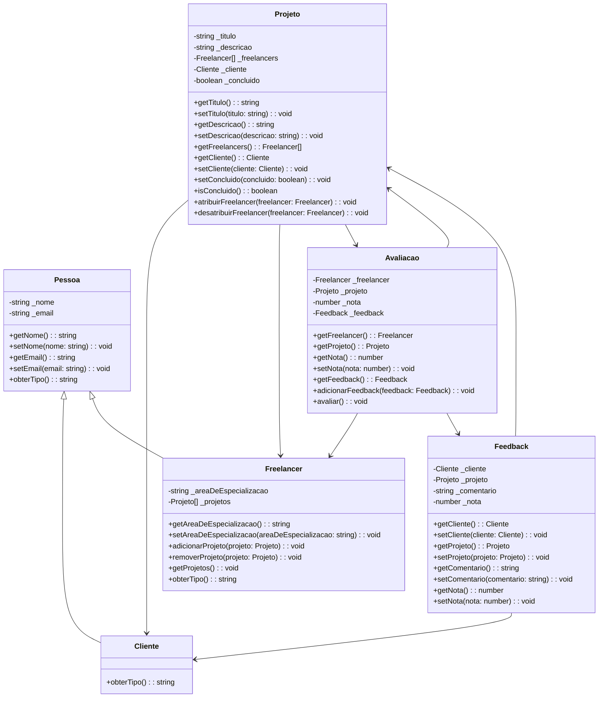

# Solução do Sistema de Freelancers Completo

Aulas 11 e 12 dedicadas a correção passo a passo do sistema de freelancers.

## Instruções do Exercício

- [Parte 1](../Aula%206-7-8/Exercicio.md)
- [Parte 2](../Aula%209-10/Exercício%20Complementar.md)

## Diagramação do Sistema

### Explicação

**Classes e Herança:**

`Pessoa` é uma classe abstrata que possui `Cliente` e `Freelancer` como subclasses.

**Associações:**

- `Projeto` está associado a `Cliente`, `Freelancer`, e `Avaliacao`.

- `Avaliacao` está associada a `Freelancer`, `Projeto`, e `Feedback`.

- `Feedback` está associado a `Cliente` e `Projeto`.

**Métodos e Atributos:**

- Atributos privados (-) e métodos públicos (+) são mostrados para cada classe.

Este diagrama ajuda a visualizar as relações entre as classes e suas interações no sistema.