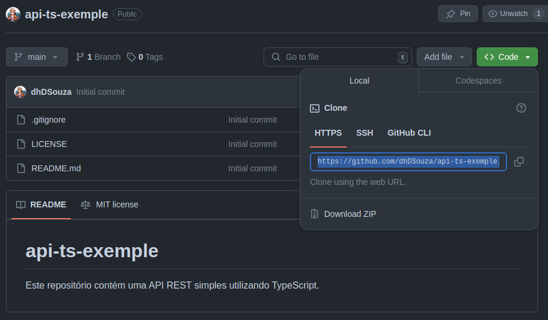

# Api Simples em TypeScript

## Atenção

Este exemplo está dentro do repositório das aulas, dentro de um diretório de aula. Entretando, quando forem criar API's é muito importante que criem um repositório separado.

- Lembem-se uma API (*Application Programing Interface*) como o próprio nome já diz, é uma aplicação, ou seja, um programa/software que deve rodar em um servidor.
- **Sendo assim, não iremos misturar arquivos que não tem nada a ver com nossa aplicação no meio dela.**

## Criando Repositório para nossa API

- Acesse sua conta no [GitHub](http://www.github.com) e crie um novo repositório.

- Na tela de criação de repositório:

    - Escolha um nome para o repositório
    - Acrescente uma descrição
    - Selecione se será **Público** ou **Privado**
    - Marque o checkbox **Add a READEME file**
    - Na caixa de seleção **Add .gitignore** selecione a opção **Node** (Necessário para aplicações em `Node`, que é o caso da nossa `API`).
    - Na caixa de seleção **Choose a license** selecione uma licensa (Geralmente utiliza-se **MIT LICENSE**).
    - Crie seu repositório

    <details>
        
    </details>

- Após a criação do repositório clone ele para o seu computador.

    - Clique no botão **<> Code**
    - Selecione o link que irá aparecer em **HTTPS**

    <details>
        
    </details>

    - Abra o terminal no seu computador navegue até a pasta onde deseja que seu repositório seja clonado.
    - Utilize o comando `git clone <link copiado anteriormente>`
        - Exemplo:
            ```sh
            git clone https://github.com/dhDSouza/api-ts-exemple.git
            ```
    

    - Agora siga com as instruções da [aula 22](../APIs%20TypeScript.md)